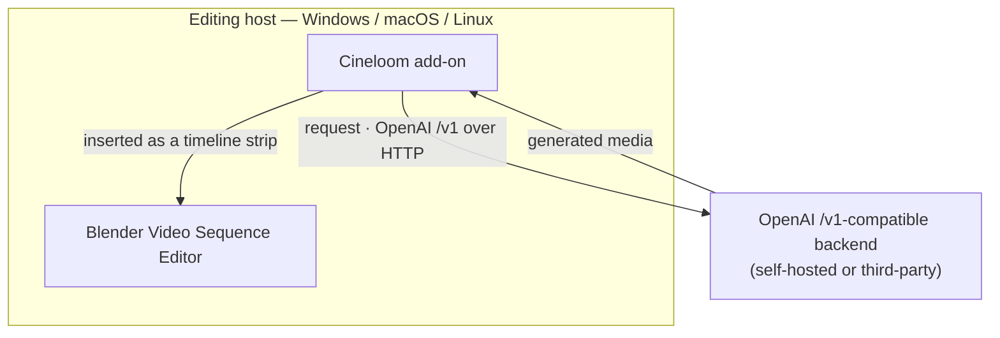
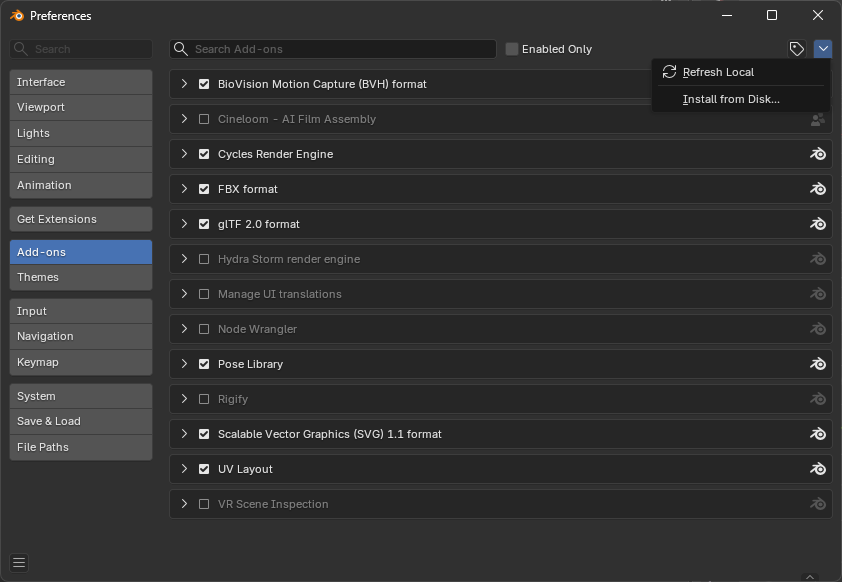

# Cineloom

Cineloom is a Blender Video Sequence Editor (VSE) add-on that integrates any
**OpenAI-`/v1`-compatible** generation backend — image, video, and audio —
directly into Blender, allowing AI-generated media to be produced and assembled
on a single editing timeline. It is a fork of
[Pallaidium](https://github.com/tin2tin/Pallaidium) (GPL-3.0-or-later).

The add-on operates as a translation layer rather than a generation engine; it
does not execute models locally. It issues requests to a backend that implements
the OpenAI `/v1` interface — whether self-hosted or provided by a third party —
and maps the responses onto Blender's editor. Generation may therefore run on any
compliant backend, while editing remains native to the user's own machine.

English · [中文](README.zh-CN.md)


## Architecture



- **Local editing.** All editing occurs on the host machine; no remote desktop or
  local GPU is required.
- **Remote generation.** Model inference runs on the configured backend.
- **Backend-agnostic.** Any service implementing the OpenAI `/v1` interface is
  supported.

## Installation

### Packaged add-on (recommended)

1. Install Blender 4.2 or later (Windows, macOS, or Linux; verified on Blender 5.1).
2. Download `cineloom.zip` from the
   [latest release](https://github.com/shiyue1250/cineloom/releases/latest).
3. In Blender, open **Edit ▸ Preferences ▸ Add-ons**, select the **▾** menu in the
   upper-right corner, choose **Install from Disk…**, and select `cineloom.zip`.
4. Confirm that **Cineloom** is enabled (checkbox ticked) in the add-ons list.
5. Open the **Video Editing** workspace and press **N** within the Sequencer to
   reveal the **Cineloom** sidebar tab.



### Backend configuration

In **Edit ▸ Preferences ▸ Add-ons ▸ Cineloom**, set the **Remote Backend URL**
(and an **API Key**, if the backend requires one), then select **Test Connection
& Discover Models** to load the backend's available models.

### From source (developers)

Clone the repository and either install the repository folder through **Install
from Disk**, or build a distributable archive with
`blender --command extension build`.

The bridge components depend only on the Python standard library; no additional
packages are required on any platform.

## Backend interface

Cineloom communicates using the OpenAI `/v1` interface. Any backend implementing
the following endpoints is compatible. Complete request and response examples,
together with the versioned contract, are documented in
[`docs/BACKEND_CONTRACT.md`](docs/BACKEND_CONTRACT.md).

| Capability | Endpoint |
|---|---|
| Model discovery | `GET /v1/models` |
| Text/image to video | `POST /v1/videos` |
| Text to image | `POST /v1/images/generations` |
| Text to speech | `POST /v1/audio/speech` |
| Transcription (ASR) | `POST /v1/audio/transcriptions` |
| Reference / control file upload | `POST /v1/files` |
| Asynchronous job status | `GET /v1/jobs/{id}` |
| Result retrieval | `GET /v1/files/{id}` |

Example — a text-to-video request:

```http
POST /v1/videos
Content-Type: application/json

{ "model": "<from /v1/models>", "prompt": "a lighthouse in a storm at night",
  "width": 768, "height": 1280, "num_frames": 121, "seed": 7 }
```

The request returns a job identifier (`{ "id": "job_abc", "status": "queued" }`).
The add-on polls `GET /v1/jobs/job_abc` until the job completes, then retrieves
the result via `GET /v1/files/{file_id}`.

## Capability coverage

Cineloom aims to provide, through the OpenAI `/v1` bridge, the generation types
offered locally by the upstream Pallaidium add-on. Current status is recorded in
[`docs/CAPABILITIES.md`](docs/CAPABILITIES.md); verified capabilities are marked
accordingly, and the remainder constitute the outstanding list.

Cineloom additionally inherits Pallaidium's local-model plugins, which execute on
a GPU on the editing machine. These remain available to users with suitable local
hardware, but the remote bridge — platform-independent and requiring no local GPU
— is the primary focus.

## Privacy and credentials

Cineloom is a local Blender add-on. It runs entirely on the user's machine and
transmits requests only to the configured backend URL. The API key is stored in
the local Blender preferences (`userpref`) and is not transmitted elsewhere by the
add-on. The preferences file should be protected as any local credential store.

## License and attribution

Cineloom is distributed under GPL-3.0-or-later, inherited from
[Pallaidium](https://github.com/tin2tin/Pallaidium) by *tintwotin*. Any distributed
derivative remains licensed under the same terms. See [LICENSE](LICENSE) and
[NOTICE.md](NOTICE.md); the original upstream README is preserved as
[README.upstream.md](README.upstream.md).

Cineloom distributes source code only — never model weights or backend services.
Each model is subject to its own license and is provided by the backend to which
the add-on connects.
