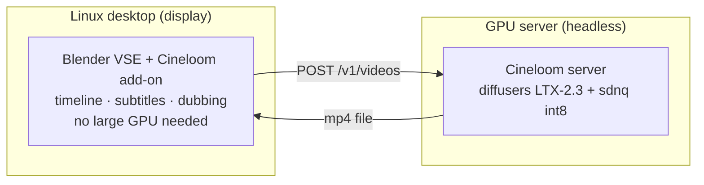

# Cineloom

Cineloom is a Blender Video Sequence Editor add-on for AI media generation,
forked from [Pallaidium](https://github.com/tin2tin/Pallaidium) (GPL-3.0-or-later).
It generates video, images, speech, music and subtitles inside the VSE and puts
the results on the timeline.

It keeps Pallaidium's model roster and add-on, and adds three things:

- A **Linux dependency installer**: a scriptable install of the verified package
  set into Blender's bundled Python, replacing the in-add-on button.
- A **remote backend**: generation can run on a separate GPU machine over an
  OpenAI-style `/v1` API, so the editing host needs no large GPU.
- A **bundled generation server** (`server/`): a containerised LTX-2.3 service
  the remote backend talks to.

English · [中文](README.zh-CN.md)


## Status

Version 0.1.0. The local models inherited from Pallaidium work as before. The
remote backend is implemented for LTX-2.3 video and verified end to end on a
Linux GPU server. The remote image and speech plugins target any compatible
`/v1` endpoint; the bundled server does not implement those yet. See
[Roadmap](#roadmap).

## Models

Every model is a Pallaidium plugin and runs locally. Each is one file in
`models_plugins/<type>/`; adding a model means adding one file (see
[`PLUGIN_AUTHORING.md`](PLUGIN_AUTHORING.md)).

**Video** — LTX-2.3 (Multimodal, Multimodal V2, Extend, IC-LoRA, Lip Sync),
LTX-2 19B distilled, Wan2.2 (T2V, I2V), SkyReels V1, MiniMax (txt2vid, img2vid,
subject2vid; cloud API), Maxine super-resolution.

**Image** — FLUX.2 (Dev, Klein 4B, Klein 9B), FLUX (Kontext, Redux, Canny,
Depth), Qwen-Image and Qwen-Image-Edit, Ideogram 4, ERNIE-Image and ERNIE-Image
Turbo, Lumina-Image 2.0, Z-Image and Z-Image Turbo, Anima, OmniGen, NucleusMoE,
Kontext Relight, Maxine super-resolution, BiRefNet (background removal).

**Audio** — Chatterbox TTS/VC and Chatterbox Turbo, MOSS-TTS, OmniVoice,
ACE-Step / Foundation-1 / Stable Audio 3 (music), MMAudio (video to audio),
Demucs stem splitter.

**Text** — Faster-Whisper (transcription into subtitle strips), Florence-2 and
Marlin (image and video captioning), MoviiGen (prompt rewriter).

### Remote models (added by Cineloom)

Three plugins send their work to the remote backend instead of running locally.
Select one in the model dropdown after setting the backend URL in preferences.

| Plugin | Endpoint | Backend |
|---|---|---|
| Cineloom Remote · LTX-2.3 | `POST /v1/videos` | bundled server (`server/`), verified |
| Cineloom Remote · Image | `POST /v1/images/generations` | any compatible `/v1` endpoint |
| Cineloom Remote · TTS | `POST /v1/audio/speech` | any compatible `/v1` endpoint |

## Architecture



A "Cineloom Remote" model sends the request to the server and downloads the
result onto the timeline. Local models are unaffected. One preference (Remote
Backend URL) selects local or remote.

## Install (Linux)

### 1. Blender

Download the official Linux build (`blender-x.y-linux-x64.tar.xz`), extract, run.
No system install required. Cineloom targets Blender 5.2+.

### 2. The add-on

The repository root is the extension (`server/`, `scripts/`, `docs/` are
excluded by `blender_manifest.toml`).

```bash
git clone https://github.com/shiyue1250/cineloom.git
# Blender: Edit > Preferences > Add-ons > Install from Disk > select the repo folder
# or build a zip: blender --command extension build
```

### 3. Dependencies

Install the verified package set into Blender's bundled Python instead of using
the in-add-on button:

```bash
scripts/install_linux.sh --blender /path/to/blender --core-only   # LTX-2.3 path
scripts/install_linux.sh --blender /path/to/blender --full        # everything
scripts/install_linux.sh --blender /path/to/blender --proxy http://127.0.0.1:1081
```

Core set: `torch 2.8+cu128`, `diffusers 0.38`, `sdnq 0.2`, `transformers 4.57`,
`opencv`.

### 4. Weights

```bash
python scripts/download_models.py \
  --repo OzzyGT/LTX-2.3-Distilled-1.1-sdnq-dynamic-int8 \
  --dest ~/ai-models/ltx23-distilled-int8
```

On networks that block HuggingFace's Xet/CAS transport, add `--proxy
http://127.0.0.1:1081` (point it at your own proxy); the downloader forces the
real `huggingface.co` endpoint through it.

## Remote backend

Set in **Edit > Preferences > Add-ons > Cineloom**:

- **Remote Backend URL** — your backend, e.g. `http://your-gpu-host:8879`
  (the bundled server) or any OpenAI-compatible `/v1` endpoint.
- **Remote API Key** — optional; sent as `Bearer`, `X-API-Key` and `?api_key`.

Then pick a "Cineloom Remote ·" model in the panel. Generation runs on the
server and the file is downloaded onto the timeline. Local models still work; the
remote option is additive.

## Cineloom server (`server/`)

A FastAPI service wrapping the LTX-2.3 diffusers stack. It uses a unique
container, image and port, pins to one GPU, mounts the model read-only and runs
one job at a time.

```bash
cp server/.env.example server/.env      # set CINELOOM_GPU, CINELOOM_MODEL_DIR, API key
docker compose -f server/docker-compose.yml up -d --build
curl http://localhost:8879/health
```

- `CINELOOM_GPU` pins the GPU; `CINELOOM_OFFLOAD` is `sequential` (~6–8 GB) or
  `model` (~10–15 GB, faster).
- `POST /v1/videos` returns `{id}`; poll `GET /v1/jobs/{id}`; fetch
  `GET /v1/files/{id}`.

See [`server/README.md`](server/README.md).

## Roadmap

- Server-side handlers for more models behind the remote backend: Wan2.2,
  FLUX images, Faster-Whisper transcription.
- Remote ASR routing into subtitle strips.
- Quality work on the LTX-2.3 path: two-stage generation, resolution handling,
  Chinese subtitles.

## License

GPL-3.0-or-later, inherited from Pallaidium. Any distributed derivative stays
open under the same license. See [LICENSE](LICENSE) and [NOTICE.md](NOTICE.md);
the original upstream readme is kept at [README.upstream.md](README.upstream.md).

Cineloom distributes code only, not model weights. Each model carries its own
license and is downloaded from its source.

Upstream: [tin2tin/Pallaidium](https://github.com/tin2tin/Pallaidium).
