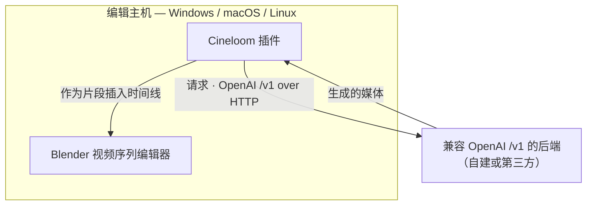

# Cineloom

Cineloom 是一款 Blender 视频序列编辑器（VSE）插件，用于将任何兼容
**OpenAI `/v1`** 接口的生成后端（图像、视频、音频）接入 Blender，使 AI 媒体的
生成与剪辑能够在同一条时间线上完成。本项目 fork 自
[Pallaidium](https://github.com/tin2tin/Pallaidium)（GPL-3.0-or-later）。

插件的定位是翻译层，而非生成引擎：其本身不在本地运行模型，而是向实现 OpenAI
`/v1` 接口的后端（自建或第三方）发起请求，并将响应映射到 Blender 编辑器中。
生成可在任意兼容后端上运行，剪辑则始终在用户本机原生进行。

[English](README.md) · 中文


## 架构



- **本地剪辑。** 所有剪辑在本机完成，无需远程桌面，编辑机无需显卡。
- **远端生成。** 模型推理在所配置的后端上运行。
- **后端无关。** 任何实现 OpenAI `/v1` 接口的服务均受支持。

## 安装

### 安装打包插件（推荐）

1. 安装 Blender 4.2 或更高版本（Windows、macOS 或 Linux；已在 Blender 5.1 验证）。
2. 从[最新发布](https://github.com/shiyue1250/cineloom/releases/latest)下载 `cineloom.zip`。
3. 在 Blender 中打开 **编辑 ▸ 偏好设置 ▸ 插件**，点击右上角 **▾** 菜单，选择
   **从磁盘安装…**，并选取 `cineloom.zip`。
4. 确认插件列表中 **Cineloom** 已**勾选启用**（仅安装不勾选则面板不会出现）。
5. 打开 **Video Editing** 工作区，在序列编辑器中按 **N** 调出侧栏，即可看到
   **Cineloom** 标签页。


### 配置后端

在 **编辑 ▸ 偏好设置 ▸ 插件 ▸ Cineloom** 中填写 **Remote Backend URL**（若后端
需要鉴权，再填写 **API Key**），随后点击 **Test Connection & Discover Models**，
即可加载后端的可用模型。

### 从源码运行（开发者）

克隆本仓库，通过 **从磁盘安装** 选择仓库目录，或使用
`blender --command extension build` 构建可分发的压缩包。

桥接组件仅依赖 Python 标准库，在任何平台上均无需额外依赖。

## 后端接口

Cineloom 采用 OpenAI `/v1` 接口通信。任何实现下列端点的后端均可接入。完整的
请求与响应示例及版本化契约见
[`docs/BACKEND_CONTRACT.md`](docs/BACKEND_CONTRACT.md)。

| 能力 | 端点 |
|---|---|
| 模型发现 | `GET /v1/models` |
| 文 / 图生视频 | `POST /v1/videos` |
| 文生图 | `POST /v1/images/generations` |
| 文本转语音 | `POST /v1/audio/speech` |
| 语音转写（ASR） | `POST /v1/audio/transcriptions` |
| 参考 / 控制文件上传 | `POST /v1/files` |
| 异步任务状态 | `GET /v1/jobs/{id}` |
| 结果获取 | `GET /v1/files/{id}` |

示例 —— 文生视频请求：

```http
POST /v1/videos
Content-Type: application/json

{ "model": "<来自 /v1/models>", "prompt": "暴风雨夜里的灯塔",
  "width": 768, "height": 1280, "num_frames": 121, "seed": 7 }
```

请求返回任务标识（`{ "id": "job_abc", "status": "queued" }`）。插件轮询
`GET /v1/jobs/job_abc` 直至任务完成，再通过 `GET /v1/files/{file_id}` 取回结果。

## 能力覆盖

Cineloom 旨在通过 OpenAI `/v1` 桥接，覆盖上游 Pallaidium 插件在本地提供的各类
生成能力。当前进度记录于 [`docs/CAPABILITIES.md`](docs/CAPABILITIES.md)：已验证的
能力均已标注，其余为待验证项。

Cineloom 同时继承了 Pallaidium 的本地模型插件，这些插件在编辑机的显卡上运行。
具备相应本地硬件的用户仍可使用，但平台无关、无需本地显卡的远端桥接是本项目的
核心方向。

## 隐私与凭据

Cineloom 是一款本地 Blender 插件，完全在用户本机运行，仅向用户所配置的后端 URL
发送请求。API Key 存储于本地 Blender 偏好设置（`userpref`）中，插件不会将其传输至
任何其他位置。请如同对待任何本地凭据一样保护该偏好设置文件。

## 许可证与致谢

Cineloom 以 GPL-3.0-or-later 分发，继承自
[Pallaidium](https://github.com/tin2tin/Pallaidium)（作者 *tintwotin*）。任何分发的
衍生作品均须以相同许可证保持开源。详见 [LICENSE](LICENSE) 与 [NOTICE.md](NOTICE.md)；
上游原始 README 保留为 [README.upstream.md](README.upstream.md)。

Cineloom 仅分发源代码，不分发模型权重或后端服务。每个模型受其各自许可证约束，
由用户所接入的后端提供。
