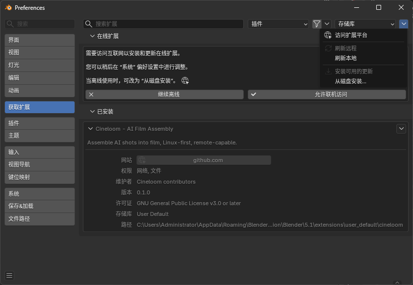

# Cineloom

Cineloom 是一个 **Blender 视频序列编辑器（VSE）插件**，把任何 **OpenAI-SDK 兼容**的
生成后端（图像 / 视频 / 音频）桥接进 Blender —— 让你在一个地方完成 AI 生成与时间线剪辑。
fork 自 [Pallaidium](https://github.com/tin2tin/Pallaidium)（GPL-3.0-or-later）。

它是**桥**，不是引擎：Cineloom 自己不跑模型。你把它指向一个讲 OpenAI `/v1` 接口的后端
（你自建的 GPU 服务，或任意在线服务商），Cineloom 负责在那个接口和 Blender 编辑器之间
做翻译。生成可以在任何地方，剪辑始终在你本机原生进行。

[English](README.md) · 中文


## 工作方式

```
Blender（Windows / macOS / Linux，你的机器）
  + Cineloom 插件
        │  OpenAI /v1 （HTTP）
        ▼
任意 OpenAI-SDK 兼容后端
  - 自建 GPU 服务，或
  - 在线 API 服务商
        │
   生成 图像 / 视频 / 音频
        ▼
  结果落到 VSE 时间线 → 剪辑、导出
```

- **剪辑本地原生** —— 不用远程桌面，编辑机不需要显卡
- **生成在远端** —— 后端在哪都行
- **后端无关** —— 只要实现 OpenAI `/v1` 接口就能接

## 安装

**安装打包好的插件（推荐）：**

1. 装 Blender 4.2+（Windows / macOS / Linux 都行）。已在 Blender 5.1 测试通过。
2. 从 [最新发布](https://github.com/shiyue1250/cineloom/releases/latest) 下载 **`cineloom.zip`**。
3. 在 Blender 里：**`Edit ▸ Preferences ▸ Add-ons`** → 右上角 **▾** 菜单 →
   **`Install from Disk…`** → 选 `cineloom.zip`。
4. 确认插件列表里 **Cineloom** 已勾选启用。
5. 打开 **Video Editing** 工作区 → 按 **N** 调出侧栏 → 出现 **Cineloom** 标签页。



**连接后端：**

在 **`Edit ▸ Preferences ▸ Add-ons ▸ Cineloom`** 里填 **Remote Backend URL**
（后端需要就再填 **API Key**），点 **Test Connection & Discover Models** ——
后端的模型就会自动列出来。

**从源码运行（开发者）：** 克隆本仓库，`Install from Disk` 选仓库目录，
或 `blender --command extension build` 生成 zip。

桥接代码只用 Python 标准库 —— 任何系统都无需额外依赖。

## 后端接入格式

Cineloom 讲 **OpenAI `/v1` 接口**。任何实现这些端点的后端都能接入。完整的请求/响应
示例与版本化契约见 [`docs/BACKEND_CONTRACT.md`](docs/BACKEND_CONTRACT.md)。

| 能力 | 端点 |
|---|---|
| 发现可用模型 | `GET /v1/models` |
| 文/图 → 视频 | `POST /v1/videos` |
| 文 → 图 | `POST /v1/images/generations` |
| 文 → 语音 | `POST /v1/audio/speech` |
| 转写（ASR） | `POST /v1/audio/transcriptions` |
| 上传参考/控制文件 | `POST /v1/files` |
| 轮询异步任务 | `GET /v1/jobs/{id}` |
| 取回结果 | `GET /v1/files/{id}` |

示例 —— 文生视频请求：

```http
POST /v1/videos
Content-Type: application/json

{ "model": "<来自 /v1/models>", "prompt": "暴风雨夜里的灯塔",
  "width": 768, "height": 1280, "num_frames": 121, "seed": 7 }
```

→ `{ "id": "job_abc", "status": "queued" }` → 轮询 `GET /v1/jobs/job_abc` →
下载 `GET /v1/files/<file_id>`。

## 能力覆盖

Cineloom 的目标是用 OpenAI `/v1` 桥接，覆盖上游 Pallaidium 在本地做的那些生成类型。
进度见 [`docs/CAPABILITIES.md`](docs/CAPABILITIES.md) —— 已验证的打勾，其余是待验证清单。

> Cineloom 也继承了 Pallaidium 的本地模型插件（在编辑机显卡上跑）。有本地显卡时仍可用，
> 但**桥接（远端、任意系统、本机不需要显卡）是主线**。

## 隐私与密钥

Cineloom 是**本地 Blender 插件** —— 完全在你机器上运行，只向你配置的后端 URL 发请求。
API Key 存在你**本地** Blender 偏好（`userpref`）里，**插件不会上传到任何地方**。把那个文件
当作本地凭据妥善保管即可。

## 许可证与致谢

GPL-3.0-or-later，继承自 [Pallaidium](https://github.com/tin2tin/Pallaidium)（作者 *tintwotin*）。
任何分发的衍生作品都需在同一许可证下保持开源。见 [LICENSE](LICENSE) 与 [NOTICE.md](NOTICE.md)；
上游原始 README 保留在 [README.upstream.md](README.upstream.md)。

Cineloom 只分发代码，不分发模型权重或后端服务。每个模型有各自的许可证，由你接入的后端提供。
