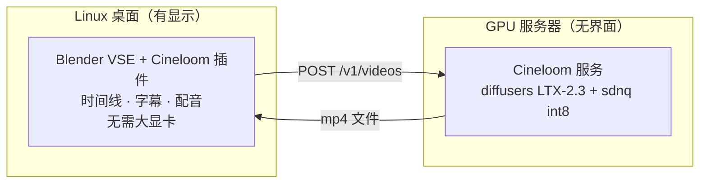

# Cineloom

Cineloom 是一个用于 AI 媒体生成的 Blender 视频序列编辑器（VSE）插件，
fork 自 [Pallaidium](https://github.com/tin2tin/Pallaidium)（GPL-3.0-or-later）。
它在 VSE 内生成视频、图像、语音、音乐和字幕，并把结果放到时间线上。

它保留了 Pallaidium 的模型清单与插件本体，并新增三样东西：

- **Linux 依赖安装脚本**：把经过验证的依赖装进 Blender 自带的 Python，替代插件内的安装按钮。
- **远端后端**：生成可以跑在另一台 GPU 机器上，走 OpenAI 风格的 `/v1` 接口，编辑端无需大显卡。
- **自带生成服务**（`server/`）：一个容器化的 LTX-2.3 服务，供远端后端调用。

[English](README.md) · 中文


## 状态

0.1.0 版本。继承自 Pallaidium 的本地模型照常工作。远端后端已实现 LTX-2.3 视频，
并在 Linux GPU 服务器上端到端验证通过。远端图像与语音插件面向任意兼容 `/v1` 端点；
自带服务暂未实现这两类。见[路线图](#路线图)。

## 模型

每个模型都是一个 Pallaidium 插件，本地运行。每个对应 `models_plugins/<类型>/` 下的一个文件；
新增模型就是加一个文件（见 [`PLUGIN_AUTHORING.md`](PLUGIN_AUTHORING.md)）。

**视频** —— LTX-2.3（Multimodal、Multimodal V2、Extend、IC-LoRA、Lip Sync）、
LTX-2 19B distilled、Wan2.2（T2V、I2V）、SkyReels V1、MiniMax（文生视频、图生视频、
主体生视频；云 API）、Maxine 超分。

**图像** —— FLUX.2（Dev、Klein 4B、Klein 9B）、FLUX（Kontext、Redux、Canny、Depth）、
Qwen-Image 与 Qwen-Image-Edit、Ideogram 4、ERNIE-Image 与 ERNIE-Image Turbo、
Lumina-Image 2.0、Z-Image 与 Z-Image Turbo、Anima、OmniGen、NucleusMoE、
Kontext Relight、Maxine 超分、BiRefNet（抠图去背景）。

**音频** —— Chatterbox TTS/VC 与 Chatterbox Turbo、MOSS-TTS、OmniVoice、
ACE-Step / Foundation-1 / Stable Audio 3（音乐）、MMAudio（视频转音频）、
Demucs 分轨。

**文本** —— Faster-Whisper（转写为字幕条带）、Florence-2 与 Marlin（图像/视频打标）、
MoviiGen（提示词改写）。

### 远端模型（Cineloom 新增）

以下三个插件把任务发往远端后端而非本地运行。在偏好设置里填好后端 URL 后，
在模型下拉里选用。

| 插件 | 端点 | 后端 |
|---|---|---|
| Cineloom Remote · LTX-2.3 | `POST /v1/videos` | 自带服务（`server/`），已验证 |
| Cineloom Remote · Image | `POST /v1/images/generations` | 任意兼容 `/v1` 端点 |
| Cineloom Remote · TTS | `POST /v1/audio/speech` | 任意兼容 `/v1` 端点 |

## 架构



选用「Cineloom Remote ·」模型时，请求发往服务器，结果下载回时间线。本地模型不受影响。
一个偏好项（远端后端 URL）即可在本地与远端之间切换。

## 安装（Linux）

### 1. Blender

下载官方 Linux 版（`blender-x.y-linux-x64.tar.xz`），解压运行，无需系统安装。
目标版本 Blender 5.2+。

### 2. 插件

仓库根目录就是扩展本体（`server/`、`scripts/`、`docs/` 已由 `blender_manifest.toml` 排除）。

```bash
git clone https://github.com/shiyue1250/cineloom.git
# Blender：Edit > Preferences > Add-ons > Install from Disk > 选择仓库目录
# 或构建 zip：blender --command extension build
```

### 3. 依赖

把经过验证的依赖装进 Blender 自带的 Python，而不是用插件内的按钮：

```bash
scripts/install_linux.sh --blender /path/to/blender --core-only   # LTX-2.3 路线
scripts/install_linux.sh --blender /path/to/blender --full        # 全量
scripts/install_linux.sh --blender /path/to/blender --proxy http://127.0.0.1:1081
```

核心依赖：`torch 2.8+cu128`、`diffusers 0.38`、`sdnq 0.2`、`transformers 4.57`、`opencv`。

### 4. 权重

```bash
python scripts/download_models.py \
  --repo OzzyGT/LTX-2.3-Distilled-1.1-sdnq-dynamic-int8 \
  --dest ~/ai-models/ltx23-distilled-int8
```

若网络封锁 HuggingFace 的 Xet/CAS 传输，加上 `--proxy http://127.0.0.1:1081`
（指向你自己的代理）；下载器会强制走真实的 `huggingface.co` 端点。

## 远端后端

在 **Edit > Preferences > Add-ons > Cineloom** 中设置：

- **Remote Backend URL** —— 你自己的后端，例如 `http://your-gpu-host:8879`
  （自带服务）或任意 OpenAI 兼容 `/v1` 端点。
- **Remote API Key** —— 可选；以 `Bearer`、`X-API-Key`、`?api_key` 形式发送。

然后在面板里选「Cineloom Remote ·」模型。生成在服务器上跑，文件下载回时间线。
本地模型照常可用，远端只是新增选项。

## Cineloom 服务（`server/`）

一个包裹 LTX-2.3 diffusers 栈的 FastAPI 服务。容器、镜像、端口唯一，钉选单块 GPU，
模型只读挂载，一次只处理一个任务。

```bash
cp server/.env.example server/.env      # 设置 CINELOOM_GPU、CINELOOM_MODEL_DIR、API Key
docker compose -f server/docker-compose.yml up -d --build
curl http://localhost:8879/health
```

- `CINELOOM_GPU` 钉选 GPU；`CINELOOM_OFFLOAD` 为 `sequential`（约 6–8 GB）或
  `model`（约 10–15 GB，更快）。
- `POST /v1/videos` 返回 `{id}`；轮询 `GET /v1/jobs/{id}`；取回 `GET /v1/files/{id}`。

详见 [`server/README.md`](server/README.md)。

## 路线图

- 在远端后端补上更多模型的服务端处理：Wan2.2、FLUX 图像、Faster-Whisper 转写。
- 远端 ASR 转写直接落为字幕条带。
- LTX-2.3 路线的画质工作：两阶段生成、分辨率处理、中文字幕。

## 许可证

GPL-3.0-or-later，继承自 Pallaidium。任何分发的衍生作品都需在同一许可证下保持开源。
见 [LICENSE](LICENSE) 与 [NOTICE.md](NOTICE.md)；上游原始 README 保留在
[README.upstream.md](README.upstream.md)。

Cineloom 只分发代码，不分发模型权重。每个模型有各自的许可证，由用户从其来源下载。

上游：[tin2tin/Pallaidium](https://github.com/tin2tin/Pallaidium)。
